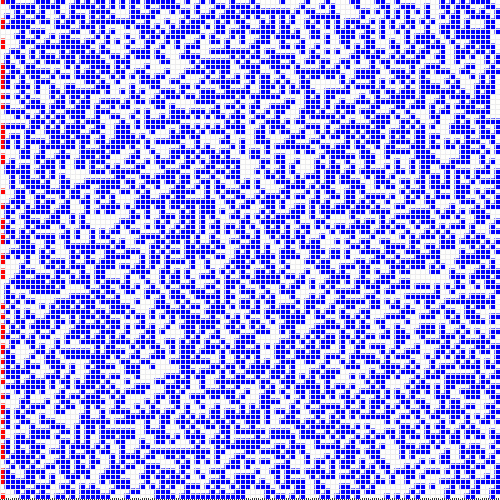

# Modelling & Simulation

One of the main limitations of the current state of Machine Learning and Deep Learning, is the constant need for new data. Although, how it can be possible then to make estimates and predictions for situations in which we don’t have any data available? This can in fact be more common than we would normally think. 

As an example, let’s consider a thought experiment: we are working as a Data Scientist for a local authority and we are asked to find a way in order to optimise how the evacuation plan should work in case of a natural disaster (e.g. volcanic eruption, heartquake, etc…). In our situation, because natural disasters don’t tend to happen too frequently (fortunately!), we don’t have any data currently available. At this point, we decide to create a model able to summarise to a good extent the key characteristics of our real world and use it to run different simulations (from which we can then get all the data we need).

In this repository, you can find available different simulations I created using MESA and HASH.

## MESA

## HASH

